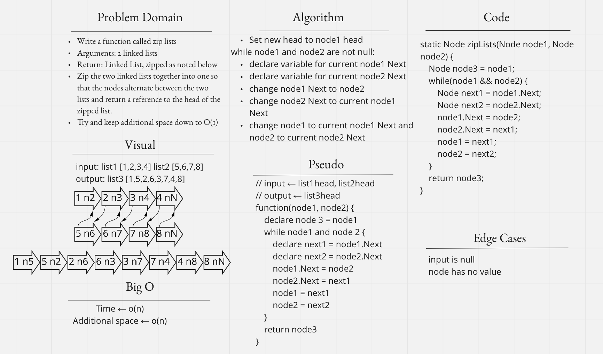

# Singly Linked List
<!-- Short summary or background information -->

[Back](../../../../../../../README.md) to Data Structures & Algorithms

## Challenge
<!-- Description of the challenge -->
[**Node**](Node.java)
- Create a Node class that has properties for the value stored in the Node, and a pointer to the next Node.

[**Linked List**](LinkedList.java)
- Create a Linked List class.
- Within your Linked List class, include a head property.
  Upon instantiation, an empty Linked List should be created.
- The class should contain the following methods:
  - `insert`
    - Arguments: value
    - Returns: nothing
    - Adds a new node with that value to the head of the list with an O(1) Time performance.
  - `includes`
    - Arguments: value
    - Returns: Boolean
    - Indicates whether that value exists as a Node’s value somewhere within the list.
  - `toString`
    - Arguments: none
    - Returns: a string representing all the values in the Linked List, formatted as:
      "{ a } -> { b } -> { c } -> NULL"
  - `append`
    - Args: new value
    - adds a new node with the given value to the end of the list.
  - `insertBefore`
    - Args: value, new value
    - adds a new node with the given new value immediately before the first node that has the value specified.
  - `insertAfter`
    - Args: value, new value
    - adds a new node with the given new value immediately after the first node that has the value specified.
  - `zipLists`
    - Args: two linked lists
    - Returns: one linked list
    - Zip the two lists together into one so that the nodes alternate between the two lists and return a reference to the head of the zipped list.
    - 

- Any exceptions or errors that come from your code should be semantic, capture-able errors. For example, rather than a default error thrown by your language, your code should raise/throw a custom, semantic error that describes what went wrong in calling the methods you wrote for this lab.
- Be sure to follow your language/frameworks standard naming conventions (e.g. C# uses PascalCasing for all method and class names).

## Approach & Efficiency
<!-- What approach did you take? Why? What is the Big O space/time for this approach? -->

## API
<!-- Description of each method publicly available to your Linked List -->
